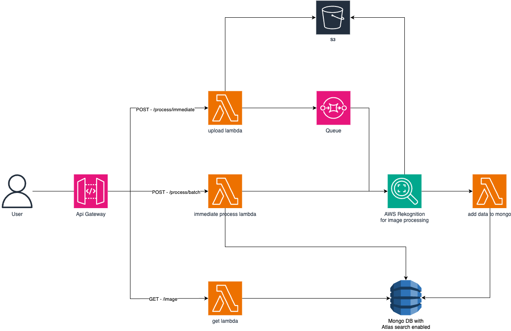

# Real-Time Image Recognition Documentation


## Introduction

This document outlines the architecture and components of a system designed to process real-time image uploads, perform image recognition using AWS rekognition deployed as serverless functions, and classify images into categories. The system employs a variety of AWS services and a MongoDB Atlas database with search capabilities.
 

## System Architecture

 

The system architecture consists of the following components and technologies:

1. **AWS Lambda:** AWS Lambda is used for serverless computing. It provides a scalable and cost-effective way to execute code in response to events. In this system, Lambda functions are utilized to trigger image recognition and classification tasks.

2. **AWS API Gateway:** AWS API Gateway is used to create and manage RESTful APIs that allow users to upload images and initiate recognition requests. It serves as the entry point to the system.
 
3. **AWS Rekognition:** AWS Rekognition is a powerful image and video analysis service. It is used to perform image recognition, identify objects, and extract labels and metadata from the uploaded images.
 
4. **AWS SQS (Simple Queue Service):** AWS SQS is used to create a message queue for asynchronous processing. When a user uploads an image, a message is sent to the SQS queue, which triggers Lambda functions to process the image.
 
5. **AWS S3 (Simple Storage Service):** AWS S3 is used to store the uploaded images securely. When an image is uploaded, it is stored in an S3 bucket, and the location of the image is included in the message sent to the SQS queue.
 
6. **MongoDB with Atlas Search:** MongoDB Atlas is a fully managed cloud database service. MongoDB Atlas Search allows for efficient searching of data within MongoDB. I preferred using it for search instead of using elastic search or AWS cloud search because if we want to use those we need to push data to those search services which added unwanted complexity. Also we used TTL index to clear old data from Collection.
    - **MongoDB version used:** 6.0.11

7. **Nodejs with Express:** Express is a minimal and flexible application for Nodejs runtime. It is designed to simplify the development of web applications and APIs by providing a robus set of features for building web and mobile application.
    - **Node version:** 18.16.1
    - **Express version:** 4.18.2

8. **Serverless framework:** Serverless is an open-source, cloud-agnostic, and developer-friendly framework for building and deploying serverless applications. It simplifies the development and deployment of serverless functions and resources, making it easier for developers to create applications without managing the underlying infrastructure.
    - **Serverless version:** 3.32.2
 
## System Workflow

There are two endpoint exposed to process files(doesn't need to be only image):

- **process/immediate** - user can upload upto 10 images and it'll be categorised immediately and sent in the response. Uploaded files will not be saved in S3 but categorised data will be stored in MongoDB for 1Hr. 

    **Response**
    ``` json
    {
        "partialSuccess": false,
        "success": [
            {
                "imageId": "cd758ff4e0779320eec0dcfe02800320",
                "fileName": "test-hydrant.jpg",
                "labels": [
                    "Fire Hydrant",
                    "Hydrant"
                ],
                "categories": [
                    "Public Safety",
                    "Tools and Machinery"
                ],
                "expireAt": "2023-10-21T19:09:01.226Z",
                "processImmediate": true
            }
        ],
        "failure": [],
        "requestId": "7ce84676ddad41468d93e5dab36f1cdc"
    }
    ```

- **process/batch** - user can upload upto 100 images and files will be uploaded to s3 and message will be sent to SQS, user will get requestId in the response and they can use it to get ipload images and categories.
    - **batch process** - SQS will trigger another lambda function and to process image recognition for batch process. It'll be same as immediate but file will not be deleted from S3 and categorised data will be deleted from MongoDb after 1Yr.
    **Response**
    ``` json
    {
        "partialSuccess": false,
        "success": [
            {
                "imageId": "66deea014a1a3f3b1dae888491fe05c8",
                "fileName": "test-hydrant.jpg",
                "expireAt": "2023-10-21T19:12:34.624Z",
                "processImmediate": false
            },
            {
                "imageId": "8577724c70284cc8cb2ec8b830edb269",
                "fileName": "test2.jpg",
                "expireAt": "2023-10-21T19:12:34.624Z",
                "processImmediate": false
            }
        ],
        "failure": [],
        "requestId": "d8e51eb1c11246099d7425a0b9aebb51"
    }
    ```
There are two endpoint exposed to get data:

- **/image/search?labels=hydant** - uses atlas search index to find data. It also supports partial text search upto two cahracters. You can find search index details below.
    **Response**
    ``` json
    [
        {
            "_id": "6511763c376c82721f5a12e7",
            "imageId": "1091b6d358ecdf6ffdf29f39ccbda791",
            "fileName": "test-hydrant.jpg",
            "expireAt": "2024-09-25T11:59:56.479Z",
            "processImmediate": false,
            "requestId": "da18c573f7284d80bfa045bd154e5f50",
            "Labels": [
                {
                    "Name": "Fire Hydrant",
                    "Confidence": 97.93754577636719,
                    "Instances": [
                        {
                            "BoundingBox": {
                                "Width": 0.2014828473329544,
                                "Height": 0.7617658376693726,
                                "Left": 0.11979608982801437,
                                "Top": 0.016503067687153816
                            },
                            "Confidence": 93.9815902709961
                        }
                    ],
                    "Parents": [
                        {
                            "Name": "Hydrant"
                        }
                    ],
                    "Aliases": [],
                    "Categories": [
                        {
                            "Name": "Public Safety"
                        }
                    ]
                },
                {
                    "Name": "Hydrant",
                    "Confidence": 97.93754577636719,
                    "Instances": [],
                    "Parents": [],
                    "Aliases": [],
                    "Categories": [
                        {
                            "Name": "Tools and Machinery"
                        }
                    ]
                }
            ],
            "LabelModelVersion": "3.0",
            "Location": "https://arun-practice.s3.ap-south-1.amazonaws.com/image-recognition/assets/1091b6d358ecdf6ffdf29f39ccbda791",
            "Key": "image-recognition/assets/1091b6d358ecdf6ffdf29f39ccbda791",
            "key": "image-recognition/assets/1091b6d358ecdf6ffdf29f39ccbda791",
            "Bucket": "arun-practice",
            "ETag": "\"257a1c299215e3e6e01b319f64020732\""
        }
    ]
    ```
- **/image/by-id?imageId=&requestId=** - you can use both requestID and/or imageId to respective request or image details. Response will be same as search api.


## Deployment and Configuration

Used Serverless framework to build this service. Service provider, Resources, Roles,... are managed in serverless.yml file. You have to configure your AWS secret and access keys in your local system and you can deploy it with simple **Serverless deploy** command it'll take care of creating resources and roles.

## Data Structure

Example

```
{
  "_id": {
    "$oid": "6511763c376c82721f5a12e7"
  },
  "imageId": "1091b6d358ecdf6ffdf29f39ccbda791",
  "fileName": "test-hydrant.jpg",
  "expireAt": {
    "$date": "2024-09-25T11:59:56.479Z"
  },
  "processImmediate": false,
  "requestId": "da18c573f7284d80bfa045bd154e5f50",
  "Labels": [
    {
      "Name": "Fire Hydrant",
      "Confidence": 97.93754577636719,
      "Instances": [
        {
          "BoundingBox": {
            "Width": 0.2014828473329544,
            "Height": 0.7617658376693726,
            "Left": 0.11979608982801437,
            "Top": 0.016503067687153816
          },
          "Confidence": 93.9815902709961
        }
      ],
      "Parents": [
        {
          "Name": "Hydrant"
        }
      ],
      "Aliases": [],
      "Categories": [
        {
          "Name": "Public Safety"
        }
      ]
    },
    {
      "Name": "Hydrant",
      "Confidence": 97.93754577636719,
      "Instances": [],
      "Parents": [],
      "Aliases": [],
      "Categories": [
        {
          "Name": "Tools and Machinery"
        }
      ]
    }
  ],
  "LabelModelVersion": "3.0",
  "Location": "https://arun-practice.s3.ap-south-1.amazonaws.com/image-recognition/assets/1091b6d358ecdf6ffdf29f39ccbda791",
  "Key": "image-recognition/assets/1091b6d358ecdf6ffdf29f39ccbda791",
  "key": "image-recognition/assets/1091b6d358ecdf6ffdf29f39ccbda791",
  "Bucket": "arun-practice",
  "ETag": "\"257a1c299215e3e6e01b319f64020732\""
}
```

## Atlas Search Index Json
Use this json to create search index in MongoDb Atlas

```json
{
  "mappings": {
    "dynamic": false,
    "fields": {
      "Labels": {
        "fields": {
          "Categories": {
            "fields": {
              "Name": {
                "type": "autocomplete"
              }
            },
            "type": "document"
          },
          "Name": {
            "type": "autocomplete"
          }
        },
        "type": "document"
      }
    }
  },
  "storedSource": {
    "include": [
      "Labels.Name",
      "Labels.Categories.Name"
    ]
  }
}
```

## Conclusion

This system leverages AWS serverless services, image recognition, and a MongoDB database to create a real-time image recognition and classification system. Users can upload images, have them processed in the cloud, and search for images based on their content. This architecture offers scalability, reliability, and cost-efficiency for image recognition applications.

 
## Additional Information

As this is not fully developed application it'll not have lot of validation or input sanitisation.